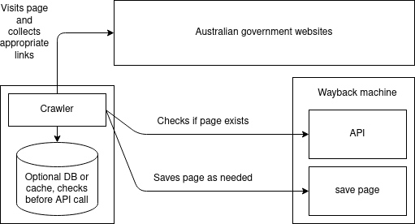

This project aims to ensure that Australian governments' pages (federal and state) never disappear from the web.

- Uses a web crawler to find australian government urls
- Checks those were recently archived with The Wayback Machine (their API)
- If not recently archived, then this sends a request to have it archived

This is the general idea

### LICENCE

The MIT licence applies.
